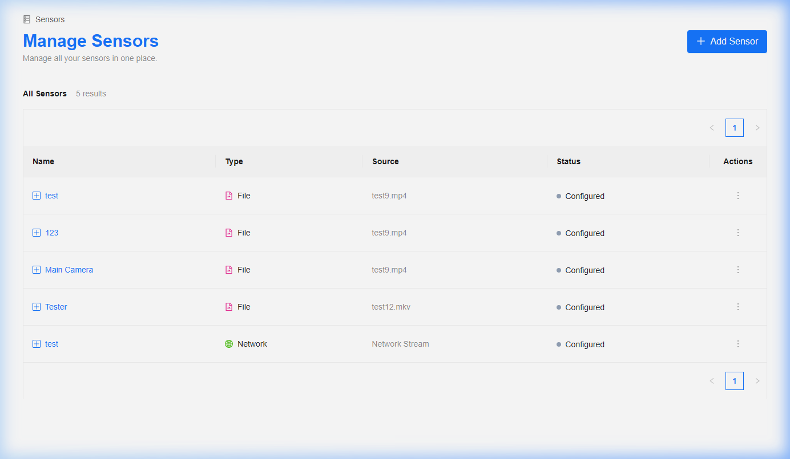
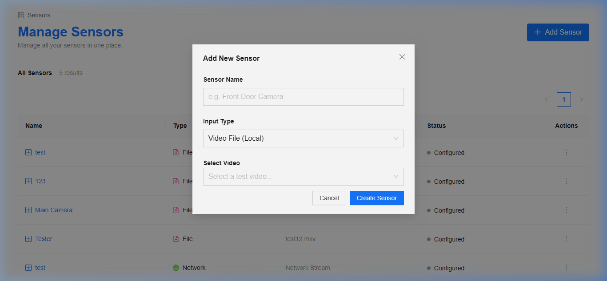
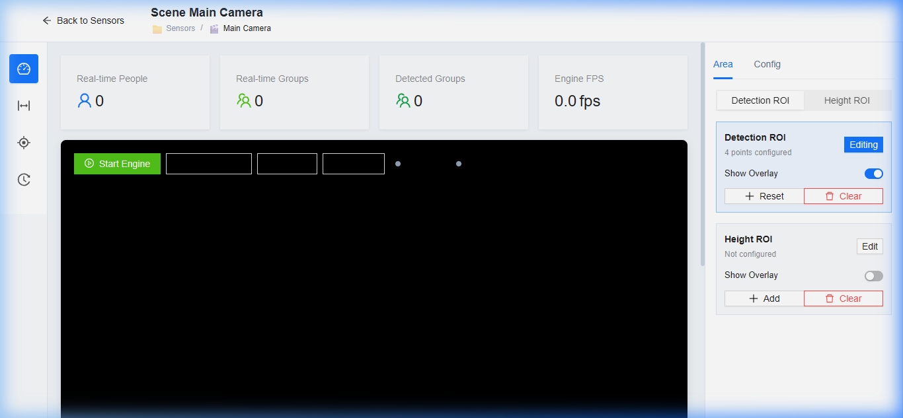

# Group Detection Dashboard — Full Documentation

The Group Detection Dashboard is a web-based control surface for the OpenVINO person/group detection runtime. It replaces manual `config.py` editing with a real-time UI for sensor management, live monitoring, ROI editing, camera undistortion tuning, runtime parameter tuning, and run summary review.

---

## Table of Contents

1. [Quick Start](#quick-start)
2. [Dashboard Overview](#dashboard-overview)
3. [Sensor Management](#sensor-management)
4. [Workspace](#workspace)
   - [Live Monitoring](#live-monitoring)
   - [ROI Zones](#roi-zones)
   - [Camera Undistort](#camera-undistort)
   - [Run Summaries](#run-summaries)
5. [Configuration & Tuning Sidebar](#configuration--tuning-sidebar)
   - [Performance Presets](#performance-presets)
   - [PAR Validation Presets](#par-validation-presets)
   - [Category Bundles](#category-bundles)
   - [Advanced Options](#advanced-options)
   - [Config Controls](#config-controls)
6. [How It's Made — Architecture](#how-its-made--architecture)
   - [Frontend (React + Vite)](#frontend-react--vite)
   - [Backend (Flask)](#backend-flask)
   - [Persistence (SQLite)](#persistence-sqlite)
   - [Runtime Engine](#runtime-engine)
7. [Backend API Reference](#backend-api-reference)
8. [Configuration Parameter Categories](#configuration-parameter-categories)
9. [Operational Workflows](#operational-workflows)
10. [Related Documents](#related-documents)

---

## Quick Start

### Prerequisites

```powershell
python -m pip install -U openvino ultralytics opencv-python numpy flask flask-cors
cd dashboard
npm install
```

### Starting the Dashboard

**Option A — Launcher script (recommended):**

```powershell
powershell -ExecutionPolicy Bypass -File .\run_dashboard.ps1
```

This starts both the backend and frontend, waits until each is reachable, opens the browser, and tears everything down on Ctrl+C.

**Option B — Manual start:**

```powershell
# Terminal 1 — Backend
py -3 dashboard_server.py

# Terminal 2 — Frontend
cd dashboard
npm run dev -- --host 127.0.0.1
```

**URLs:**

| Service  | URL                          |
|----------|------------------------------|
| Backend  | `http://127.0.0.1:8765`     |
| Frontend | `http://127.0.0.1:5173`     |

### Smoke Check

Before using the full dashboard, you can verify the backend boots cleanly:

```powershell
py -3 .\scripts\smoke_dashboard_backend.py
```

---

## Dashboard Overview

When the dashboard loads, the app goes through a boot sequence that:

1. Connects to the Flask backend API.
2. Loads sensor metadata and config state.
3. Decides which view to show:
   - **Booting** — spinner while the backend initializes.
   - **Error** — if the backend is unreachable, with a "Retry Connection" button.
   - **Sensor List** — if no sensor is currently active.
   - **Workspace** — if a sensor is already loaded.

---

## Sensor Management

The **Manage Sensors** page is the landing page of the dashboard. It provides a centralized view of all configured sensors.



### What You Can Do

| Action        | How                                                                 |
|---------------|---------------------------------------------------------------------|
| **Add sensor**    | Click the blue **+ Add Sensor** button at the top right.        |
| **Load sensor**   | Click any row in the sensor table to enter its workspace.       |
| **Delete sensor** | Click the ⋮ menu on a row → **Delete Sensor** → confirm.       |
| **View status**   | The Status column shows: Configured, Selected, Running, Paused. |

### Adding a New Sensor

Click **+ Add Sensor** to open the creation modal:



You provide:

1. **Sensor Name** — a friendly label (e.g. "Front Door Camera")
2. **Input Type** — one of:
   - **Video File (Local)** — pick from files in the `media/` folder.
   - **Network Stream (RTSP)** — enter an RTSP or HTTP URL.
   - **Local Camera (USB)** — select a device index (0–10).
3. Click **Create Sensor**.

Each sensor stores its own configuration snapshot, so different cameras/videos can have completely independent tuning.

### How It Works (API)

| Operation      | Endpoint                   | Method |
|----------------|----------------------------|--------|
| List sensors   | `/api/sensors`             | GET    |
| Create sensor  | `/api/sensors`             | POST   |
| Load sensor    | `/api/sensors/load`        | POST   |
| Delete sensor  | `/api/sensors/<id>`        | DELETE |

Loading a sensor updates the backend config and marks it active. If the engine is already running, it resets with the new config.

---

## Workspace

After loading a sensor, you enter the **Workspace** — the main operational shell. It has three layout regions:



| Region            | Purpose                                                               |
|-------------------|-----------------------------------------------------------------------|
| **Left nav bar**  | Icon buttons to switch between workspace views (4 views).             |
| **Central pane**  | The active view content (Live Feed, ROI editor, Undistort, Summaries).|
| **Right sidebar** | Contextual controls — ROI editing (Area tab) or Tuning (Config tab).  |

The top header shows the sensor name, breadcrumbs (`Sensors / <name>`), and a **← Back to Sensors** button to return to the sensor list.

### Workspace Navigation Icons (Left Bar)

| Icon | View              |
|------|-------------------|
| 📊   | Live Monitoring   |
| 🔲   | ROI Zones         |
| ⊕    | Camera Undistort  |
| 🕐   | Run Summaries     |

---

### Live Monitoring

**File:** `dashboard/src/views/LiveFeed.tsx`

The primary validation and operation view. It shows:

- **Stats cards** at the top — Real-time People, Real-time Groups, Detected Groups, and Engine FPS.
- **MJPEG video stream** — the annotated live feed from the engine.
- **Engine control bar** — overlaid on the video with buttons:
  - ▶ **Start Engine** — begins processing.
  - ⬛ **Stop** — stops the engine.
  - 🔄 **Reset** — restarts the engine with current config.
  - ⏸ **Pause** — pauses/resumes processing.
- **Video playback controls** (file sources only):
  - Play/Pause video, Restart, frame-accurate seek slider.
  - Loop toggle, speed selector (0.5×, 1×, 1.5×, 2×).
  - Frame counter and timestamp display.
- **System Logs** — scrollable feed of backend log messages.

**Stream URL:** `http://localhost:8765/video_feed?t=<key>&w=<width>&h=<height>`

**Behavior notes:**
- When the engine is not running, a "Stream Offline – press Start Engine" overlay appears.
- Leaving Live Monitoring to another tab automatically captures a workspace snapshot (used by ROI and Undistort tabs) and pauses/stops the engine depending on source type.

---

### ROI Zones

**Files:** `SensorConfig.tsx`, `ZoneCanvas.tsx`, `WorkspaceSidebar.tsx`

A visual polygon editor for defining where detections are accepted and where height-based age logic runs.

**Two zone types:**

| Zone           | Purpose                                                     | Config Keys                    |
|----------------|-------------------------------------------------------------|--------------------------------|
| Detection ROI  | Only accept person detections inside this area.             | `roi_polygon`, `use_roi`       |
| Height ROI     | Only run height sampling / age-lock logic inside this area. | `height_roi_polygon`           |

**How to use:**

1. Navigate to the ROI Zones view (second icon in the left nav).
2. In the right sidebar under **Area** tab, select **Detection ROI** or **Height ROI**.
3. Click **+ Add** to create a default 4-point box, or **+ Reset** if one already exists.
4. Drag the corner points on the canvas to position the zone.
5. Toggle **Show Overlay** to visualize the mask.
6. Click **Save Configuration** (in the sidebar) to persist.
7. Use **Clear** to remove a zone entirely.

Each ROI uses exactly 4 normalized points (0–1 coordinate space).

---

### Camera Undistort

**File:** `UndistortCanvas.tsx`, `Undistortion.tsx`

A side-by-side comparison view for lens calibration. Shows the original frame alongside the corrected (undistorted) version using the current lens settings.

**Lens parameters controlled via the Tuning sidebar (Lens category):**

| Parameter            | Description                            |
|----------------------|----------------------------------------|
| `undistort_enable`   | Master toggle for undistortion.        |
| `undistort_model`    | `fisheye` or `standard`.              |
| `undistort_fx` / `fy`| Focal lengths.                        |
| `undistort_balance`  | Fisheye: 0 = crop, 1 = full FOV.     |
| `undistort_alpha`    | Standard: 0 = crop, 1 = full FOV.    |
| `undistort_coeffs`   | Distortion coefficients string.       |

**How it works:** Uses a captured workspace snapshot — intentionally avoids maintaining a second continuous video stream.

---

### Run Summaries

**File:** `TestSummary.tsx`

A history view of completed engine runs and saved artifacts.

Each row shows:
- Run timestamp
- Source name
- Peak people and group counts
- Average FPS

**Artifact downloads:**
- Annotated video (`.mp4`)
- Detection data (`.json`)

**API:** `GET /api/summaries`, `GET /api/summaries/<id>/artifact/video`, `GET /api/summaries/<id>/artifact/json`

Run summaries are only generated when `save_session_artifacts` is enabled in Performance settings.

---

## Configuration & Tuning Sidebar

**File:** `dashboard/src/views/Tuning.tsx`

The right sidebar's **Config** tab is the primary runtime tuning surface. It is organized into several sections from top to bottom:

### Performance Presets

Quick-apply latency/quality profiles:

| Preset           | Effect                                      |
|------------------|---------------------------------------------|
| **Performance**  | `imgsz=320`, `skip_frames=3` — max FPS.    |
| **Balanced**     | `imgsz=416`, `skip_frames=2` — middle ground.|
| **Quality**      | `imgsz=640`, `skip_frames=1` — max accuracy.|

### PAR Validation Presets

Targeted configurations for validating the Person Attribute Recognition pipeline:

| Preset               | Purpose                                            |
|----------------------|----------------------------------------------------|
| **Body PAR Only**    | Enable body PAR gender/attributes, disable face.   |
| **Height Age Only**  | Enable height-based age pipeline, disable face/PAR.|
| **Face Override Check** | Enable face age/gender overrides for comparison.|
| **Full Analytics**   | Enable everything: body PAR, face, height, pose.  |

### Category Bundles

Coarse feature switches that enable/disable groups of related runtime features at once:

- **Unselect all** → raw video (no detection, no tracking).
- **Select all** → full feature stack.
- Individual bundles for detection, demographics, lens, etc.

### Advanced Options

Toggle **Show Advanced Options** to reveal expert-level controls:

- ReID tuning (similarity thresholds, update intervals)
- Advanced group scoring (lock thresholds, angle history)
- Debug/performance flags (verbose logging, perf stats)

### Config Controls

| Button         | Action                                                  |
|----------------|---------------------------------------------------------|
| **Reset**      | Reset all parameters to engine defaults.                |
| **Export**      | View and copy current config as JSON.                   |
| **Load Preset**| Load a previously saved preset from the database.       |
| **Save Preset**| Save the current config snapshot with a name.           |

### Category Navigation

Below the controls, icon buttons let you switch between parameter categories: **Detection ROI**, **Height ROI**, **Input**, **Detection**, **Demographics**, **Groups**, **Tracking**, **Performance**, **Display**, **Lens**, and **Advanced**.

Each category shows sliders, toggles, dropdowns, and text inputs generated from the `PARAM_META` metadata defined in `dashboard_server.py`.

**Conditional visibility:** The tuning panel intelligently hides irrelevant settings. For example:
- Face override settings are hidden until face age detection is enabled.
- Body PAR age label mappings are hidden until body PAR age contribution is enabled.
- Pose gate thresholds are hidden until pose gating is enabled.

**Restart notifications:** When a parameter marked with `needs_restart: true` is changed, a sticky "System Change" banner appears with an **Apply & Restart** button.

---

## How It's Made — Architecture

### Frontend (React + Vite)

| Technology     | Purpose                            |
|----------------|-------------------------------------|
| React 18       | UI component framework             |
| TypeScript     | Type-safe development              |
| Vite           | Dev server and build tool           |
| Ant Design     | UI component library (antd)        |
| Inter font     | Typography                          |

**Key source files:**

```
dashboard/src/
├── App.tsx                    # Root component, boot flow
├── views/
│   ├── SensorList.tsx         # Sensor management page
│   ├── SensorConfig.tsx       # Workspace shell + ROI canvas
│   ├── LiveFeed.tsx           # Live stream + engine controls
│   ├── Tuning.tsx             # Configuration sidebar
│   ├── TestSummary.tsx        # Run summaries view
│   └── Undistortion.tsx       # Undistortion live feed
├── components/
│   ├── workspace/
│   │   ├── WorkspaceHeader.tsx
│   │   ├── WorkspaceNav.tsx
│   │   ├── WorkspaceSidebar.tsx
│   │   ├── ZoneCanvas.tsx
│   │   ├── UndistortCanvas.tsx
│   │   ├── EngineControlBar.tsx
│   │   └── WorkspaceStatusBanner.tsx
│   ├── controls/
│   │   └── ConfigPanel.tsx
│   ├── logs/
│   │   └── LogFeed.tsx
│   └── shell/
│       └── AppStateView.tsx
├── contexts/
│   └── ConfigContext.tsx       # Global state provider
├── hooks/
│   └── useDashboardController.ts
├── services/
│   └── api.ts                 # Backend API client
└── presets/
    ├── performanceProfiles.ts  # Performance + PAR presets
    └── categoryBundles.ts      # Category bundle definitions
```

**Boot flow:**

1. `App.tsx` mounts → `ConfigProvider` initializes → attempts to load backend state.
2. `useDashboardController` decides the phase: `booting` → `error` or `sensor-list` or `workspace`.
3. Views are lazy-loaded with `React.lazy()` for code-splitting.

### Backend (Flask)

| Technology     | Purpose                            |
|----------------|-------------------------------------|
| Flask          | HTTP API server                     |
| Flask-CORS     | Cross-origin support               |
| OpenCV         | Video capture and frame processing  |
| OpenVINO       | Neural network inference            |

**Key source files:**

```
dashboard_server.py            # Entry point, PARAM_META, Flask app
dashboard_backend/
├── __init__.py
├── routes.py                  # All API endpoint handlers
├── engine_manager.py          # Engine lifecycle (start/stop/pause/reset)
├── config_store.py            # Runtime defaults dict (from config.py)
├── persistence.py             # SQLite init and helpers
└── streaming.py               # MJPEG frame streaming
```

**How PARAM_META works:**

The `PARAM_META` dictionary in `dashboard_server.py` is the single source of truth for the tuning UI. Each entry specifies:

```python
"conf": {
    "cat": "Detection",     # UI category
    "type": "float",        # Control type: float, int, bool, str, select
    "min": 0.1, "max": 1.0, # Slider range
    "step": 0.01,           # Slider step
    "desc": "Confidence threshold",
    "needs_restart": False,  # Requires engine restart?
    "advanced": False,       # Hidden behind Advanced toggle?
}
```

The frontend reads this metadata via `GET /api/config` and dynamically generates the appropriate controls (sliders, toggles, dropdowns).

### Persistence (SQLite)

The database file `settings.db` stores:

| Table           | Purpose                                      |
|-----------------|----------------------------------------------|
| **sensors**     | Named sensor configs with source details.    |
| **presets**     | Reusable config snapshots.                   |
| **summaries**   | Run history with artifact paths and metrics. |

Initialized via `dashboard_backend/persistence.py` using `init_db()`.

### Runtime Engine

The dashboard controls the same detection runtime used by `run_openvino_yolo.py`:

```
config.py                      # OpenVinoDefaults dataclass
run_openvino_yolo.py           # Main detection runner
scripts/
├── person_detector.py         # YOLO person/head detection
├── group_detector.py          # Social group clustering
├── perspective_detector.py    # Camera angle heuristics
├── demographics_classifier.py # Body PAR (gender, attributes)
├── height_age_classifier.py   # Height-based age estimation
├── pose_estimator.py          # Pose keypoint inference
├── face_age_classifier.py     # Face-based age/gender override
└── image_undistorter.py       # Lens undistortion
```

The `EngineManager` class in `engine_manager.py` wraps this runtime in a thread, managing start/stop/pause/reset lifecycle from the dashboard.

---

## Backend API Reference

### Engine Control

| Endpoint                | Method | Description                              |
|-------------------------|--------|------------------------------------------|
| `/api/engine/status`    | GET    | `{running, paused, people, groups, fps}` |
| `/api/engine/start`     | POST   | Start the engine thread.                 |
| `/api/engine/stop`      | POST   | Stop the engine thread.                  |
| `/api/engine/pause`     | POST   | Toggle pause; returns `{paused}`.        |
| `/api/engine/run_default` | POST | Alias for start.                         |
| `/api/reset`            | POST   | Restart engine with current config.      |

### Configuration

| Endpoint                | Method | Description                              |
|-------------------------|--------|------------------------------------------|
| `/api/config`           | GET    | Current values + parameter metadata.     |
| `/api/config`           | POST   | Update one or more config values.        |
| `/api/defaults`         | POST   | Reset config to `OPENVINO_DEFAULTS`.     |

### Presets

| Endpoint                | Method | Description                              |
|-------------------------|--------|------------------------------------------|
| `/api/presets`          | GET    | List available presets.                  |
| `/api/save`             | POST   | `{name}` — save current config as preset.|
| `/api/load`             | POST   | `{name}` — load preset; returns values.  |

### Sensors

| Endpoint                | Method | Description                              |
|-------------------------|--------|------------------------------------------|
| `/api/sensors`          | GET    | List all sensors.                        |
| `/api/sensors`          | POST   | Create a new sensor.                     |
| `/api/sensors/load`     | POST   | Load a sensor into the workspace.        |
| `/api/sensors/<id>`     | DELETE | Delete a sensor.                         |

### Streaming & Media

| Endpoint                | Method | Description                              |
|-------------------------|--------|------------------------------------------|
| `/video_feed`           | GET    | MJPEG stream of annotated frames.        |
| `/api/videos`           | GET    | `{videos:[...], current:"..."}`.         |
| `/api/switch`           | POST   | `{mode, video|camera}` — hot-swap input. |
| `/api/workspace/snapshot` | GET  | Captured workspace frame.                |
| `/api/undistort/comparison` | GET | Original vs corrected comparison.      |

### Run Summaries

| Endpoint                          | Method | Description                    |
|-----------------------------------|--------|--------------------------------|
| `/api/summaries`                  | GET    | List all run summaries.        |
| `/api/summaries/<id>/artifact/video` | GET | Download annotated video.     |
| `/api/summaries/<id>/artifact/json`  | GET | Download detection JSON.      |

### Logs

| Endpoint    | Method | Description                     |
|-------------|--------|---------------------------------|
| `/api/logs` | GET    | `{logs: [{time, msg}]}`.       |

---

## Configuration Parameter Categories

The tuning UI organizes 80+ runtime parameters into these categories:

| Category        | Key Parameters                                                         |
|-----------------|------------------------------------------------------------------------|
| **Detection**   | `conf`, `iou`, `imgsz`, `skip_frames`, `detect_body`, `detect_head`   |
| **Tracking**    | `stable`, `track_iou`, `min_hits`, `max_misses`, `smooth`             |
| **Groups**      | `group_detect`, `group_min_history`, distance thresholds               |
| **Demographics**| `detect_gender`, `detect_age`, body PAR, face override, pose controls  |
| **Performance** | `turbo_mode`, `mimic_live`, `save_session_artifacts`                   |
| **Display**     | `show_person_boxes`, `show_ui_overlay`, `preview_width/height`, labels |
| **Lens**        | `undistort_enable`, `undistort_model`, focal lengths, coefficients     |
| **Detection ROI** | `use_roi`, `roi_polygon`, `show_roi_mask`, `roi_transparency`       |
| **Height ROI**  | `height_roi_polygon`, `age_adult_threshold_px`, min samples            |
| **Input**       | `input_mode`, `source`, `camera_index`, `device`, `perspective`        |
| **Advanced**    | ReID tuning, group scoring internals, debug flags                      |

---

## Operational Workflows

### Basic Validation Workflow

1. Open the dashboard at `http://127.0.0.1:5173`.
2. **Add or select a sensor** from the Manage Sensors page.
3. In the workspace, **start the engine** in Live Monitoring.
4. Observe stats (people count, group count, FPS) and the annotated stream.
5. Switch to the **Config** tab in the right sidebar to tune parameters.
6. Use **ROI Zones** to define detection and height regions.
7. Check **Run Summaries** to review saved artifacts after stopping the engine.

### PAR Validation Workflow

1. Load a representative sensor.
2. Open the Config sidebar.
3. Apply a PAR validation preset (e.g. **Body PAR Only**).
4. Set Detection ROI and Height ROI if needed.
5. Start the engine.
6. Observe: bounding boxes, track stability, gender/attribute labels, age transitions, height ROI waiting/pending/lock behavior.
7. Switch presets to compare different pipeline configurations.

### Switching Between Sources

- **From sensor list:** Create sensors with different source types (file, camera, network).
- **Hot-swap:** Use `POST /api/switch` to change input without restarting.
- **Network streams:** Enter RTSP URLs directly when creating a sensor.

---

## Related Documents

- [Model Documentation](../model_documentation.md) — detection models, algorithms, and social grouping logic.
- [PAR Runtime Status](./par_runtime_status.md) — current PAR merge state.
- [PAR Runtime Smoke Test](./par_runtime_smoke_test.md) — validation steps.
- [Height Calibration API](../height_calibration.openapi.yaml) — OpenAPI spec.
